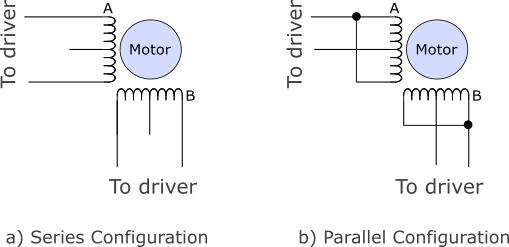

A lot of detailed information about stepper motors can be found online and doesn't need to be repeated here, e.g.:

- [Stepper Motor](https://en.wikipedia.org/wiki/Stepper_motor) - Wikipedia article
- [Stepper motors and stepper drivers](http://www.machinebuilding.net/ta/t0627.htm) - Bill Schweber from Mouser Electronics

## Motor Types

### Unipolar Steppers

Unipolar Steppers have a center tap on both coils. This allows for a simple drive electronics. You can keep the center tap at GND / 0V and alternately switch both ends of the coil to the operating voltage. Opposed to bipolar types there is no need to reverse the polarity of the driving voltage. A simple full step stepping sequence is shown in the figure below: 

 

However, since only half of a coil is energized at a time this leads to a less efficient operation compared to the bipolar scheme below. 

### Bipolar Steppers

Most modern steppers are of the bipolar type. For bipolar steppers the current through the coils A and B needs to be reversed from step to step. A simple full step stepping sequence is shwon in the figure below: 

 

### Wiring types

The following figure shows usual wiring configurations for unipolar and bipolar steppers.

 

 
- Motors intended for bipolar operation are usually assembled in a 4 wire configuration. 
- The 5 wire configuration can be operated in unipolar mode only.  The cheap geared stepper 28BYJ-48 is a popular representative of this motor type. 
     
  Please note that the omnipresent stepper drivers DRV8825, A4998, TB6600... are bipolar types and can not be used for this kind of steppers.

- The 6 and 8 wire configurations can be driven by unipolar and bipolar drivers. 
  If you want to drive such a stepper in bipolar mode you can either connect the coils in series (high torque, low speed) or in parallel (low torque, high speed).  
 

## Motor Parameters
### Size and Torque

NEMA, definition, link to norm

table key parameters, including link to grabcad 3d models

## Motor Types

Voltage driven
Current driven

current, voltage, inductivity

