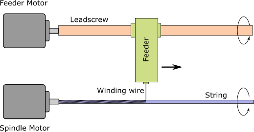
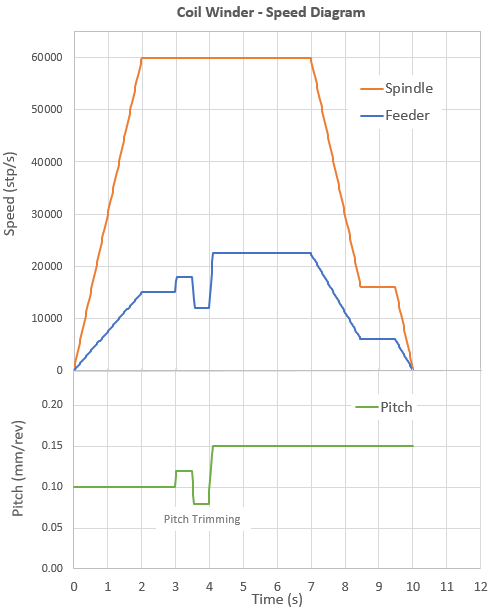

<table border="0" class="none">  
  <col width="600">
  <col width="200">
  <tr>
    <td valign="top">
      <ul>
        <li><a href="#overview">Overview</a></li>
        <li><a href="#simple-approach">Simple Approach</a></li>
        <li><a href="#implementing-a-winder-class">Implementing a Winder Class</a></li>       
      </ul>
    </td>
    <td valign = "top" align="right">
      <a href="assets/largeTitle.png">
        
      </a>
    </td>   
  </tr>  
</table>


## Overview

The following figure shows the principal setup of a coil winder. A string (blue) is rotated by the spindle motor. While the spindle rotates the feeder (green) linearly moves parallel to the string and winds a wire on the string. It is important that the ratio of the feeder speed and the spindle rotation stays constant even during acceleration and deceleration phases to keep a constant winding pitch. 




## Simple Approach
TeensyStep is able to move steppers in sync. Using this feature a quick solution to the problem is easily coded. The following snippet shows how that works out using the two stepper motors 'feeder' and 'spindle':
```c++
...
constexpr unsigned speed = 5; // mm/s
constexpr float pitch = 0.2;  // mm/rev

feeder.setMaxSpeed(speed * fdrStpPerMM);        // set speed in steps/sec
spindle.setMaxSpeed(speed/pitch*spdlStpPerRev); // calculate from pitch
controller.rotateAsync(feeder, spindle);        // and start the motors
...
```
Here, ```fdrStpPerMM``` holds the number of feeder steps required for a 1mm travel, ```spdlStpPerRev``` holds the number of steps per spindle revolution and the winder pitch is given in mm per spindle revolution. The code moves the feeder at 5 mm/s and rotates the spindle at 5.0 / 0.2 = 25 rev/s = 1500 rpm. Since the controller takes care that the motors will stay in sync, the winding pitch stays at a constant 0.2 mm/rev even during acceleration and deceleration. 

*Speed Adjustment*   
In case you want to adjust the speed of the motors on the fly you can override the current speed using ```RotateControl::overrideSpeed(float speedFactor)```.
A value of 0.8 would decelerate both motors to 80% of their current speed. Of course, the speed ratio and thus the winding pitch will stay constant during this operation. 


## A Winder Class

For advanced applications you might need a possibility to slightly trim the pitch to compensate mechanical imprecision of the machine or thickness variation of the winding wire. However, changing the pitch on the fly would require that spindle and feeder steppers change their fixed speed ratio, which is something the built in Bresenham synchronizing algorithm can not do. 

Thus, we need to provide some flexible external sync algorithm. To do this we can use two rotation controllers, one for each motor. We then calculate rotation speed and acceleration in such a way that the motors will generate the required, and adjustable pitch. To not clutter the main sketch with detailed calculations it makes sense to abstract away all the low level stuff in a dedicated winder class.   
Here the interface of this class: 

```c++
class Winder
{
public:
    Winder(Stepper &spindle, Stepper &feeder);

    Winder &setSpindleParams(unsigned stpPerRev, unsigned acceleration); // steps per spindle revolution & acceleration in stp/s^2
    Winder &setFeederParams(unsigned stpPerMM, unsigned acceleration);   // steps to move the feeder 1mm, acceleration for pitch trimming
    void begin();

    void setSpindleSpeed(float rpm);  // changes the spindle speed to the given rpm
    void setPitch(float pitch_in_mm); // changes the winder pitch to the given value
    void updateSpeeds();

    inline int getCurSpindleSpeed() { return spindleCtrl.isRunning() ? spindleCtrl.getCurrentSpeed() : 0; }
    inline int getCurFeederSpeed() { return feederCtrl.isRunning() ? feederCtrl.getCurrentSpeed() : 0; }
    inline float getCurPitch() { return (float)getCurFeederSpeed() / getCurSpindleSpeed() / pitchFactor; }

protected:
    Stepper &spindle;
    Stepper &feeder;

    unsigned spindleStpPerRev, spindleAcc, feederStpPerMM, feederAcc;
    float pitchFactor;

    float targetSpindleSpeed, targetPitch;
    float oldSpindleSpeed, oldPitch;

    RotateControl feederCtrl, spindleCtrl;
};
```
**Construction**   
The constructor takes references to the spindle and feeder steppers. No need to define a controller, this is done within the class
```c++
Stepper spindle(0,1);             // STP pin 0, DIR pin 1
Stepper feeder(2,3);              // STP pin 2, DIR pin 3

Winder winder(spindle, feeder);   // winder uses the steppers
```

**Setup Mechanical Properties**   
Before using the class you need to setup the mechanical properties of spindle and feeder. 

The function ```setSpindleParams``` takes the number of steps per spindle revolution and the requested spindle acceleration (stp/s^2). ```setFeederParams``` takes the number of steps to move the feeder 1mm and an acceleration value (stp/s^2). This acceleration is used for pitch trimming only; for normal synced movements the feeder acceleration is calculated from the spindle acceleration and the target speeds of both motors. After setting up the parameters a call to *begin()* is required.   
The class supports a classical or a fluid interface for the setup functions: 
```c++
// classic:
winder.setSpindleParams(6400, 30000);
winder.setFeederParams(12800, 10000);
winder.begin();

// fluent:
winder
  .setSpindleParams(6400, 30000)
  .setFeederParams(12800, 10000)
  .begin();
```

**Controlling the Winder**   
Controlling the winder is easy. You set or change the spindle speed (rpm) by a calling ```setSpindleSpeed(float rpm).``` The winding pitch (mm/rev) can be set or changed on the fly by calling ```setPitch(float pitch).``` Both functions only preset the values. The actual change is performed by a call to the function ```updateSpeeds().``` To stop the winder simply set the spindle speed to 0. 

You can find a quick example of the usage below. The sketch first sets up the winder and then performs the following actions: 

1. Start the winder at a spindle speed of 1125 rpm and a pitch of 0.1mm/rev
2. After 3.0s trim the pitch to 0.12 mm/rev
3. After 0.5s trim the pitch to 0.08 mm/rev
4. After 0.5s trim the pitch to 0.15 mm/rev
5. After 3.0s change the spindle speed to 300 rpm, keep pitch at 0.15 mm/rev
6. After 2.5s stop the winder


```c++
#include "Winder.h"

IntervalTimer printTimer;                           // print out info in the background
void printCurrent();

constexpr unsigned feederStpPerMM = 200 * 8 * 5.0f; // e.g. stp/rev * microstepping * leadscrew pitch
constexpr unsigned feederAcceleration = 10000;      // used for pitch changing only
constexpr unsigned spindleStpPerRev = 200 * 16;     // e.g. stp/rev * microstepping
constexpr unsigned spindleAcceleration = 30000;     // any reasonable value

Stepper spindle(0, 1);
Stepper feeder(2, 3);
Winder winder(spindle, feeder);                     

void setup()
{
  while (!Serial && millis() < 500);

  // setup background printing
  printTimer.begin(printCurrent, 25000);
  printTimer.priority(255);                         // lowest priority, don't disturb stepping

  // setup the winder
  winder
      .setSpindleParams(spindleStpPerRev, 30000)
      .setFeederParams(feederStpPerMM, 100000)
      .begin();

  // startup the winder
  winder.setSpindleSpeed(1125); // 1125 rpm
  winder.setPitch(0.1f);        // pitch = 0.10 mm / rev
  winder.updateSpeeds();        // apply new settings

  // change pitch (simulate trimming)
  delay(3000);
  winder.setPitch(0.12);                            
  winder.updateSpeeds();

  // change pitch (simulate trimming)
  delay(500);
  winder.setPitch(0.08);
  winder.updateSpeeds();

  // change pitch (simulate trimming)
  delay(500);
  winder.setPitch(0.15);
  winder.updateSpeeds();

  // slow down spindle to 300 rpm, keep pitch
  delay(3000);
  winder.setSpindleSpeed(300);
  winder.updateSpeeds();

  // stop winder
  delay(2500);
  winder.setSpindleSpeed(0);
  winder.updateSpeeds();
}

void loop()
{
}

// helpers ----------------------------------------------

void printCurrent()
{
  unsigned t = millis();
  unsigned feederSpeed = winder.getCurFeederSpeed();
  unsigned spindleSpeed = winder.getCurSpindleSpeed();
  float curPitch = winder.getCurPitch();

  if (spindleSpeed != 0 || feederSpeed != 0)
  {
    Serial.printf("%d\t%i\t%i\t%.3f\n", t, spindleSpeed, feederSpeed, curPitch);
  }
}
```
The sketch uses an IntervalTimer to periodically (50ms) call ```printCurrent()``` which gets the current speed of the motors, calculates the pitch and prints the result on the serial port. The exported data was pasted into a spread sheet to generate the following v-t diagram.



 The diagram shows the speed profile of the spindle (red) and the feeder (blue). The generated pitch is shown in green below the speed profiles. 

The complete implementation of the Winder class can be found on [GitHub](https://github.com/luni64/TeensyStep/tree/develop/examples/Applications/Winder)
