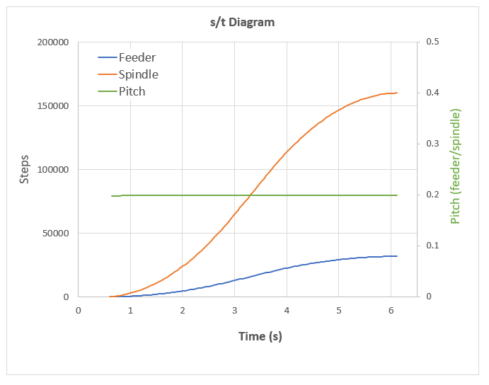

## Overview

The following figure shows the principal setup of a coil winder. A string (blue) is rotated by the spindle motor. While the spindle rotates the feeder (green) linearly moves parallel to the string and winds a wire on the string. It is important that the ratio of the feeder speed and the spindle rotation stays constant even during acceleration and deceleration phases to keep a constant winding pitch. 


### Simple Approach
Since both StepControl and RotateControl are able to rotate motors in  sync a quick solution to the problem is easily done. 

```c++
#include "TeensyStep.h"

constexpr unsigned feederStpPerMM = 3200;   // feeder steps for 1mm travel
constexpr unsigned spindleStpPerRev = 3200; // spindle steps for 1 revolution
constexpr float pitch = 0.2;                // 0.2 mm per spindle revolution

Stepper spindle(0, 1), feeder(2, 3);        // Define two steppers...
StepControl controller;                     // ...and the controller to move them

void setup()
{
  while (!Serial && millis() < 500);        // wait for a serial monitor to connect

  spindle                                   // setup the motors with some reasonable
      .setMaxSpeed(50000)                   //  values for speed and acceleration
      .setAcceleration(20000);

  feeder
      .setMaxSpeed(50000)
      .setAcceleration(20000);

  feeder.setTargetAbs(10.0 * feederStpPerMM);            // 10mm travel
  spindle.setTargetAbs(10.0 / pitch * spindleStpPerRev); // calculate a target to match the pitch:
                                                         // (100mm / 0.2 mm/rev) * 6400 stp/rev
  controller.moveAsync(feeder, spindle);                 // and start the movement
}

void loop()
{
  if (controller.isRunning()) // print out motor positions and pitch while motors are running
  {
    unsigned t = millis();
    unsigned feederPos = feeder.getPosition();
    unsigned spindlePos = spindle.getPosition();
    Serial.printf("%d\t%d\t%d\t%.3f\n", t, spindlePos, feederPos, float(feederPos) / spindlePos);
  }
  delay(50);
```

The shown code periodically prints out the current speed of the feeder and spindle motor and the ratio (spindle speed)/(feeder speed). 




TBD....

